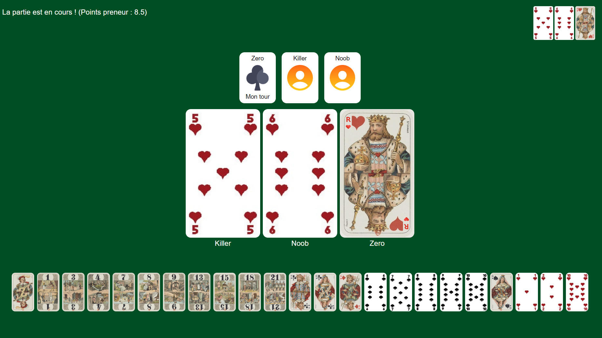

# Tarot Game

> November 2023 to now

## I. Context

An online tarot game to play with friends remotely.

  

## II. Releases

**In progress**

**To do**

**2508.1.7.2**
- Possibility to rejoin game after disconnection
- Improve UX and displayed information
- Fix global score calculation

**2501.1.6.0**
- Choose turn sound
- Cancel contract
- Offset last cards after zooming one
- King called displayed when game start
- Display contract

**2412.1.5.0**
- Take small, guard + score system

**2412.1.4.0**
- Game translated in french
- Turn of player making the chien marked
- At the end of the chien, fold cleared

**2412.1.3.1**
- Fix excuse calculation in takers score

**2412.1.3.0**
- Migration to TypeScript

**2411.1.2.0**
- Reset last fold when new game start
- Card figures with letters
- Click ENTER to join the game

**2410.1.1.1**
- Fix excuse consideration in number of oudlers
- Fix auto-size layers
- Fix icon size

**2410.1.1.0**
- Show who takes what
- Reduce card sizes
- Show last fold
- Change beginner after each game
- Add nicknames
- 4-player Tarot
- Real-time points
- Faster zoom, smaller size
- Show everyone whose turn it is
- Implement everyone passes
- Close gameover menu
- Know who plays what
- Show who took
- Your turn sound
- Rule can't play at first turn, color taken

**2410.1.0.1**
- Block joiner during a game
- Excuse not counted (for oudlersNb)
- "Play" anti-spam
- Same size cards
- Heart queen bug (best card bug with wrong color)
- Point counter issue
- "Your Turn" issue + Can pass but not your turn
- Restart game issue
- Score issue
- Partner score not take in account
- Excuse issue if fold lose
- Issue if first color is Excuse
- Excuse issue if fold win but winner don't have excuse

## III. Getting Started

In the project directory, you can run:

### `npm start` or `npm run start`

Runs the app in the development mode.\
Open [http://localhost:5001](http://localhost:5001) to view it in your browser.

The page will reload when you make changes.\
You may also see any lint errors in the console.

### `tsx ./server.js`

Runs the server.

### `npm test`

Launches the test runner in the interactive watch mode.\
See the section about [running tests](https://facebook.github.io/create-react-app/docs/running-tests) for more information.

### `npm run build`

Builds the app for production to the `build` folder.\
It correctly bundles React in production mode and optimizes the build for the best performance.

The build is minified and the filenames include the hashes.\
Your app is ready to be deployed!

See the section about [deployment](https://facebook.github.io/create-react-app/docs/deployment) for more information.